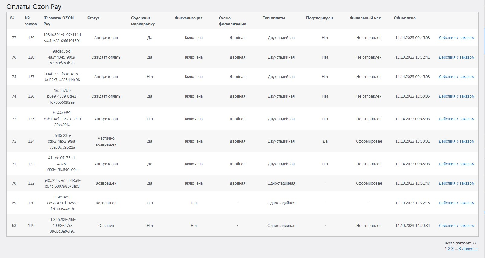
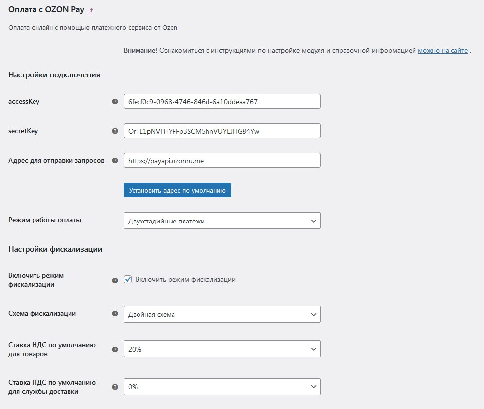
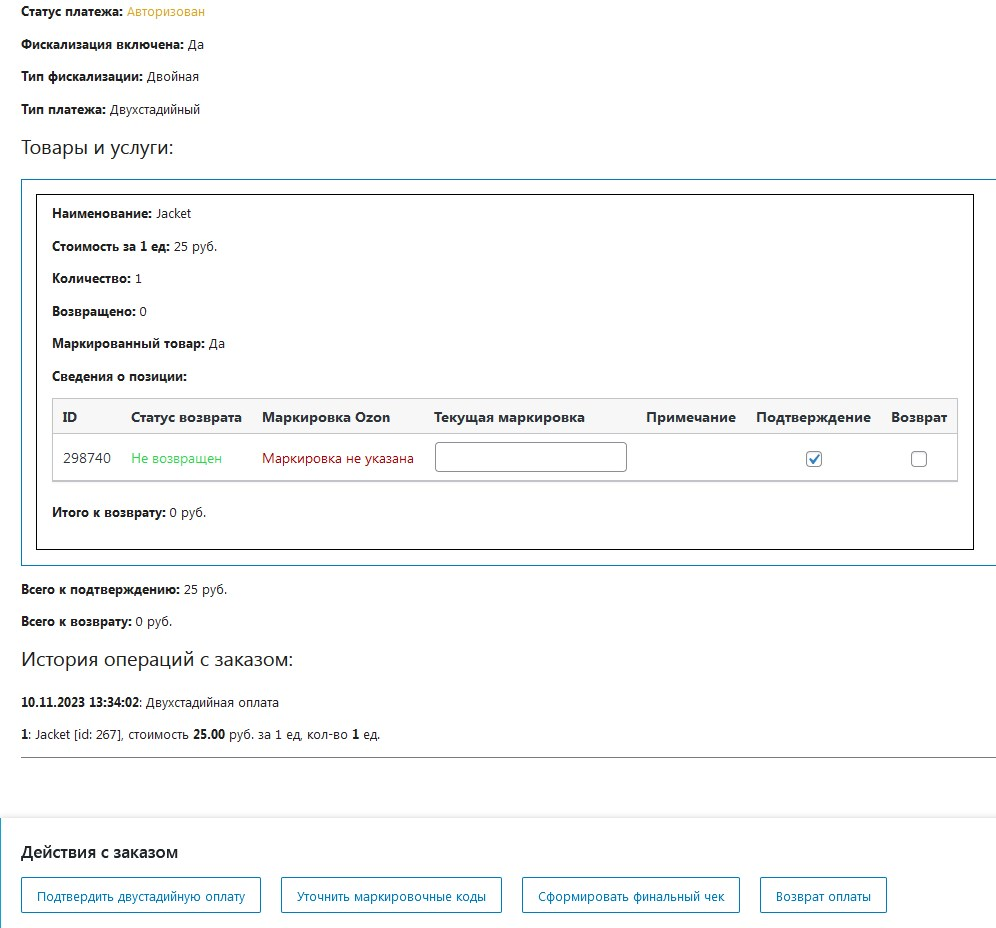
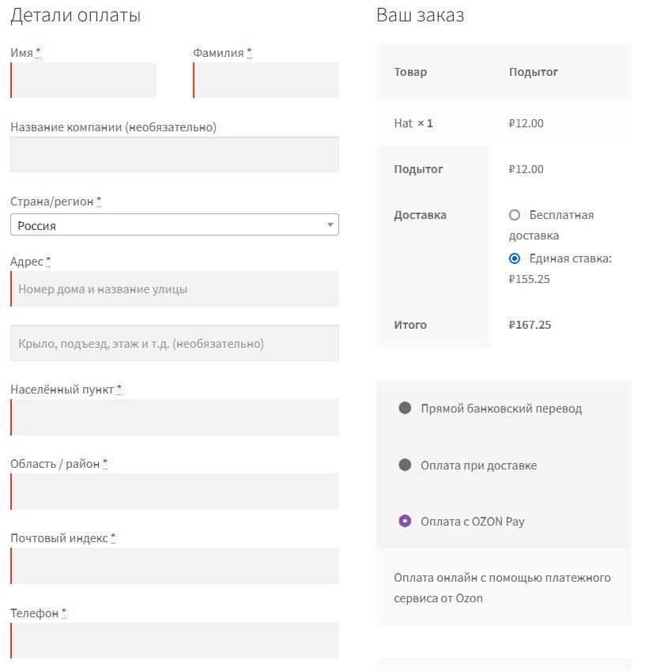

# Официальный платежный модуль Эквайринг OZON Pay для WordPress WooCommerce.

Модуль позволит принимать вашему интернет-магазину принимать платежи при помощи Эквайринга OZON Pay, вы получите следующие возможности:

* Предоставление покупателю способа оплаты заказа банковской картой;
* Возможность автоматической генерации онлайн-чека;
* Автоматическое определение налоговой ставки у продукта в чеке среди стандартных ставок НДС: 0%, 10%, 20%, без налога;
* Протоколирование всех произведенных платежным модулем банковских транзакций;
* Отдельная страница протокола и управления банковскими транзакциями;
* Возможность обновления информации о любой банковской транзакции в любой момент;
* Хранение и ведение актуального состояния чека (с учетом произведенных возвратов в заказе);
* Возможность ведения лог-файла для отладки запросов в OZON Pay;
* Возможность произведения возврата денежных средств за заказ;
* Возможность произведения частичного возврата денежных средств за заказ при помощи выбора возвращаемых отдельных позиций товаров;
* Возможность работы в одностадийном или двухстадийном режиме оплаты;
* Возможность работы с маркируемыми товарами согласно законодательству РФ;
* Возможность работы с одинарной или двойной схемой фискализации.

Вы можете выбрать в настройках модуля, в каком режиме должен будет работать модуль.

***Внимание!*** *Для работы этого платежного модуля необходимо заключить договор с Эквайрингом OZON Pay.*

## Установка

1. Скачайте и распакуйте архив с модулем;
1. Его содержимое скопируйте в директорию /wp-content/plugins/ipol_ozonpay/ Вашего сайта;
1. Активируйте плагин на странице "Плагины" WordPress;
1. Перейдите на страницу "WooCommerce / Настройки / Платежи / Оплата с OZON Pay", нажмите кнопку "Управление", находящуюся в строке модуля и произведите настройку плагина;
1. После указания ключей доступа (accessKey, secretKey) можно начинать принимать платежи.

## Скриншоты

1. 
1. 
1. 
1. 